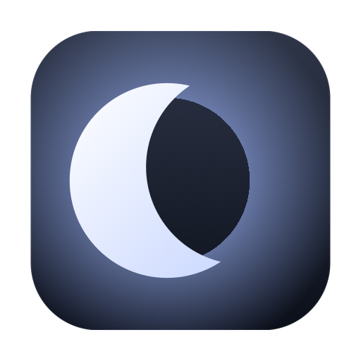

<div align="center">



# Umbra

**Black out the physical screens of a Mac while a remote session keeps seeing the desktop.**

[](https://github.com/frapsd/Umbra/actions/workflows/build.yml)
[](LICENSE)
[](#install)

</div>

You are working on your Mac from somewhere else — AnyDesk, TeamViewer, RustDesk,
Screen Sharing, VNC — and the monitors sitting in the room are showing everything
you do to whoever walks past. This is the everyday case for a headless-ish Mac
mini in a home or office you are not currently in.

Umbra turns those panels black with a keystroke, without touching what the remote
session receives, and without putting the Mac to sleep.

Press <kbd>⌃</kbd><kbd>⌥</kbd><kbd>⌘</kbd><kbd>B</kbd> to black out, press it
again to restore.

- No permissions requested — not Screen Recording, not Accessibility
- No display disconnects, so windows never get reflowed
- Works on displays with no DDC/CI channel at all
- Cannot lock you out: macOS undoes the main effect if the app dies
- One file per concern, ~700 lines, no dependencies

---

## How it works

Two layers. The first covers every display; the second improves the result where
the hardware allows it.

### Layer 1 — gamma (universal)

Umbra zeroes each display's gamma transfer table. Those tables are applied at
scanout, **after** the stage screen-capture APIs read from, so the panel goes
black while the remote session keeps receiving the real desktop.

If that sounds too convenient to be true, it was measured rather than assumed.
Capturing the screen normally, then again with the gamma tables zeroed, on a
Mac mini M2 running macOS 26:

```
baseline capture   : mean brightness 41.8 / 255
capture while black: mean brightness 41.8 / 255

VERIFIED: capture is unaffected by gamma (100% of baseline).
```

Identical to the decimal. The second capture — taken while both physical panels
were black — contains the ordinary desktop. You have also already seen the same
mechanism at work: f.lux and Night Shift tint your screen through this stage, and
their tint never shows up in a screenshot.

This layer uses public CoreGraphics API only, needs no entitlement and no
permission prompt, and works on any display — including monitors that ignore
DDC/CI entirely.

### Layer 2 — DDC/CI backlight (where available)

Gamma makes the *content* black, but an LCD backlight stays lit behind it, which
in a dark room reads as very dark grey rather than black. Where a display answers
DDC/CI, Umbra also drives its physical backlight to zero (`VCP 0x10`).

On Apple Silicon, DDC does not go through IOFramebuffer — that is the Intel path.
It goes through the display coprocessor's AV services, reachable through the
unexported `IOAVService*` symbols in IOKit, the same route
[MonitorControl](https://github.com/MonitorControl/MonitorControl) and
[Lunar](https://lunar.fyi) take. Umbra resolves them with `dlsym`, so a future
macOS that removes them costs you layer 2 and nothing else.

---

## Design notes

The interesting parts of this project are the things that did **not** work. Both
were found by measurement, not reasoning.

### Why the panel is not powered off (`VCP 0xD6`)

Turning the panel off outright is the obvious route to true black, and DDC has a
command for it. An ASUS PA278CV over USB-C even advertises support for it in its
capabilities string: `D6(01 04 05)`.

It was tried. Sending `0xD6 = 0x05` does not put the panel in standby — **it
drops the link**. Measured on a Mac mini M2:

- active displays as seen by macOS went from 2 to 1
- the monitor's AV service disappeared from the IORegistry
- with the service gone, there was no channel left to deliver a wake command
- recovery required the monitor's physical power button

Even a monitor that woke back up cleanly would not save the approach, because a
display vanishing makes macOS **reflow every window onto the survivors** — during
a remote session, precisely the thing that must not happen.

So brightness is the only safe hardware lever, and `--selftest-ddc` explicitly
asserts that the display count is unchanged across a dim/restore cycle.

### Why the DDC packets look the way they do

`IOAVServiceWriteI2C(service, 0x37, 0x51, buffer, length)` contributes the
destination and source address bytes itself through its `chipAddress` and
`dataAddress` arguments. The wire format of a DDC request is:

```
0x6E 0x51 <0x80|len> <payload…> <checksum>
└──┬────┘ └──────────────┬──────────────┘
 from the args        the buffer
```

Repeating `0x51` at the head of the buffer — the intuitive thing to do — produces
a malformed packet, and displays answer with a DDC null message (`6E 80 BE`)
rather than an error. It looks exactly like "this monitor does not support DDC".

### Why the hotkey uses Carbon

`RegisterEventHotKey` is ancient API, and it is still the right one.
`NSEvent.addGlobalMonitorForEvents` would need the Accessibility permission —
the right to observe every keystroke on the machine — which is absurd for an app
that dims screens. Carbon hotkeys need no permission at all.

---

## You cannot get locked out

The gamma layer is self-healing: WindowServer reverts a client's gamma when that
client dies. This was verified with `SIGKILL`, not assumed. So in the worst case,
from a remote session or over SSH:

```bash
killall Umbra
```

and the screens come back immediately.

The DDC layer has no such guarantee — a monitor left at brightness 0 stays there
if the process dies. Umbra therefore **writes the pre-blackout levels to disk
before dimming** and reapplies them on next launch, so relaunching is enough. The
monitor's own OSD buttons are always the final fallback.

If you would rather Umbra never touched your monitors' settings at all, pick
**Gamma only** from the menu.

---

## The physical limit

On an LCD, brightness 0 is not "off" — it is minimum. In a lit room the screen
looks black. In a dark room a faint glow remains.

There is no software fix. `0x10` is the only brightness lever monitors expose,
and the one command that would genuinely kill the backlight is the `0xD6` that
drops the link. If you need absolute black, use the monitor's own power button
and accept the window reflow, or put a display emulator plug on the port.

---

## Alternatives, and when to prefer them

Umbra is narrow on purpose. Several of these are better tools for their own job.

| Instead of Umbra | Use it when | Why it does not solve this |
|---|---|---|
| [MonitorControl](https://github.com/MonitorControl/MonitorControl) | you want proper brightness and volume keys for external displays | it is a brightness manager, not a blackout toggle: no single-key blackout, and it does not touch gamma, so displays without DDC stay lit |
| [Lunar](https://lunar.fyi) | you want adaptive brightness, presets, per-display curves | same reason, plus most of what you would need here is paid |
| [BetterDisplay](https://github.com/waydabber/BetterDisplay) | you want resolution, scaling, virtual displays, HiDPI | its dimming overlay is drawn into the framebuffer, so a remote session sees the dimming too — the exact thing to avoid |
| Locking the screen (`⌃⌘Q`) | you want actual security, not just privacy | the remote session gets the lock screen too; you cannot keep working |
| Display sleep (`pmset displaysleepnow`) | nobody is using the machine | remote mouse or keyboard input wakes the displays straight back up |
| The monitor's own power button | you want absolute black and do not mind doing it by hand | on most setups the link drops, so macOS reflows every window onto the remaining displays |

The distinction that matters: a **software overlay** is composited into the
framebuffer and therefore captured by remote desktop software. **Gamma** is not.
That is the entire reason this project exists.

---

## Install

Requires macOS 13 or later, Apple Silicon, and the Xcode Command Line Tools.

```bash
git clone https://github.com/frapsd/Umbra.git
cd Umbra
./build.sh --install
open /Applications/Umbra.app
```

Then enable **Launch at Login** from the menu. macOS requires the app to live in
`/Applications` before it will register a login item.

To build without installing, run `./build.sh` and find the bundle in `build/`.

> Umbra is signed ad-hoc, not with a Developer ID, so a build you did not compile
> yourself will be quarantined by Gatekeeper. Building from source — the command
> above — avoids this entirely.

---

## Verify it on your hardware

```bash
build/Umbra.app/Contents/MacOS/Umbra --selftest
```

Lists your displays, probes each one for DDC, and runs a full blackout/restore
cycle **reading the values back from the hardware** rather than trusting return
codes. Your screens flash for under a second.

```
Active displays
  [ok]   id=1  2048×1152 (external, main)
  [ok]   id=2  1920×1080 (external)

DDC/CI
  [ok]   IOAVService symbols resolved
  [warn] service #0  no DDC response — gamma blackout only
  [ok]   service #1  PA278CV  brightness 100/100

Gamma cycle (verified by reading the hardware back)
  [ok]   starting gamma: 1.000, 1.000
  [ok]   blackout applied to 2/2 displays
  [ok]   verified: gamma is zero on every display — 0.000, 0.000
  [ok]   verified: gamma restored — 1.000, 1.000

Result
  ALL CHECKS PASSED
```

Add the backlight cycle with `--selftest-ddc`. It dims each DDC-capable display
to zero, confirms the level by reading it back, checks that no display dropped
off the bus, then restores and confirms again.

---

## Configuration

The shortcut can be changed without a preferences window, using Carbon virtual
key codes and modifier masks:

```bash
# ⌃⌥⌘P instead of ⌃⌥⌘B
defaults write io.github.frapsd.Umbra hotKeyCode -int 35

# modifiers: control 4096, option 2048, shift 512, command 256 — summed
defaults write io.github.frapsd.Umbra hotKeyModifiers -int 7424
```

If the combination is already claimed by another app, Umbra says so on launch and
the menu bar item keeps working.

---

## Known hardware behaviour

Support for layer 2 depends on the port as much as the monitor.

| Setup | Gamma | DDC |
|---|---|---|
| ASUS PA278CV over USB-C / DisplayPort | yes | yes — brightness 0↔100 verified |
| Generic 1080p on a Mac mini's built-in HDMI | yes | no response, not even to a capabilities request |

The HDMI port on Apple Silicon Macs frequently does not carry a usable I2C
channel. If a monitor shows no DDC, try moving it to a Thunderbolt/USB-C port
with an adapter, and check for a `DDC/CI` toggle in the monitor's own OSD menu.
Umbra picks up the change on its own — use **Rescan Displays**.

Contributions of results from other hardware are welcome.

---

## Layout

| File | Role |
|---|---|
| `Sources/GammaBlanker.swift` | layer 1: gamma, display enumeration, reconfiguration |
| `Sources/DDCService.swift` | layer 2: DDC/CI over IOAVService, packet framing, capabilities |
| `Sources/BlackoutController.swift` | state machine, layer ordering, cleanup |
| `Sources/HotKey.swift` | global hotkey via Carbon |
| `Sources/MenuBarApp.swift` | status item, menu, login item |
| `Sources/SelfTest.swift` | hardware verification |
| `Tools/make-icon.swift` | draws the app icon, so it lives in diffs rather than a binary blob |

---

## License

MIT — see [LICENSE](LICENSE).
